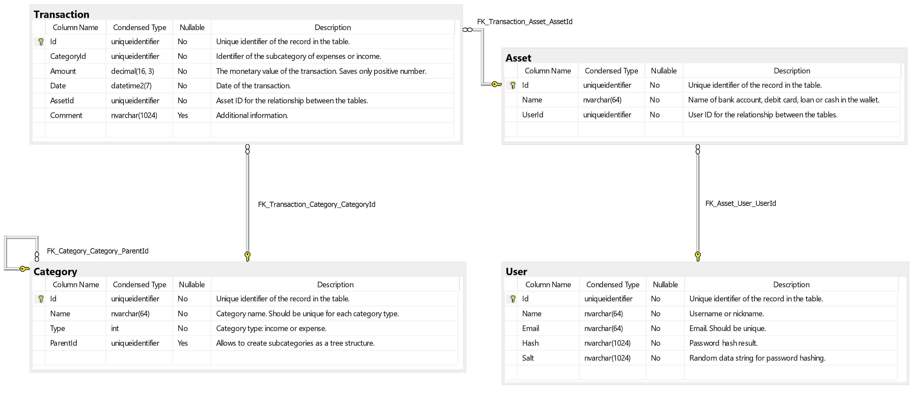

# Money manager #
## Short Description ##
In this task, you will need to perform a series of commands and queries to the database of the Money Manager Application using the .NET Framework and ORM technology. "Money Manager" is the simplest application for an accounting of your expenses and income. Its database consists of four entities:
- User – storage of basic user information.
- Asset – the user can have several different sources of income: cash, debit cards, bank account, loan, etc.
- Category – all categories divide into two groups according to the type of operation (expenses or income). For example, Expenses category might be Food, Social Life, Transportation, Culture, Self-development. Income category might be Salary, Bonus, Petty cash and others. For a detailed analysis of the source of income and expenses, the Money Manager Company decided that each category might contain several child categories. Example, the category Transportation will include Taxi, Public transport, and Parking subcategories. In this way, we form a tree structure.
- Transaction - tracks all users’ operations in the system. The transaction type calculates based on the category type. In this way, the subcategory type cannot be different from the category type.
## Topics ##
- .NET LINQ
- .NET ORM
- Entity Framework Core
## Requirements ##
- Consider the database diagram:

- [x] Create entity models using code first approach.
- [x] Create a class that will generate data to insert into database tables. The system should run the code from this class for the first time when the database is empty or not exist. After filling the data, the user table should contain more than 10 records, asset table – more than 20 records, category (including several subcategories) – more than 10 records, transaction table – more than 1000 records. Please, wrap the logic of filling the database into a single transaction. If an exception occurs during the transaction execution, perform the rollback.
- [ ] Create a data layer to get access to the database with ORM technology using commands and queries:
  - [x] For each entity write creating, updating and deleting commands.
  - [ ] [x] Write a command to delete all users' (parameter userId) transactions in the current month.
  - [x] For each entity write queries that will return the entity by identifier.
  - [ ] [x] Write a request to return the user by email.
  - [ ] [x] Write a query to return the user list sorted by the user’s name. Each record of the output model should include User.Id, User.Name and User.Email.
  - [ ] [x] Write a query that will return the current balance for the user. Each record of the output model should include User.Id, User.Email, User.Name, and Balance.
  - [ ] [x] Write a query that will return the asset list for the selected user (userId) ordered by the asset’s name. Each record of the output model should include Asset.Id, Asset.Name and Balance.
  - [ ] [x] Write a query to return the transaction list for the selected user (userId) ordered descending by Transaction.Date, then ordered ascending by Asset.Name and then ordered ascending by Category.Name. Each record of the output model should include Asset.Name, Category.Name (transaction subcategory), Category.ParentName (transaction parent category), Transaction.Amount, Transaction.Date and Transaction.Comment.
  - [ ] Write a query that will return the total value of income and expenses for the selected period (parameters userId, startDate, endDate) ordered by Transaction.Date and grouped by month. Each record of the output model should include total Income and Expenses, Month and Year.
  - [ ] Write a query that will return the total amount of all parent categories for the selected type of operation (Income or Expenses). The result should include only categories that have transactions in the current month. Input parameters in this query will be UserId and OperationType (category type). Each record of the output model should include Category.Name and Amount. In addition, you should order results descending by Transaction.Amount and then ordered them by Category.Name.
- [ ] Money Manager Company decided to not use the category tree structure in the application. Add a manual migration to remove ParentId column from the Category table. You must use the parent category for all transactions which have been linked to subcategories. No one record in the table should be lost. Update needed logic inside the Data Access layer.
- [ ] Add a manual migration to include a Current Balance column to the Asset entity. The value of the column should be automatically updated by creating, updating or deleting transaction. Please, analyze several approaches and choose the most effective.
