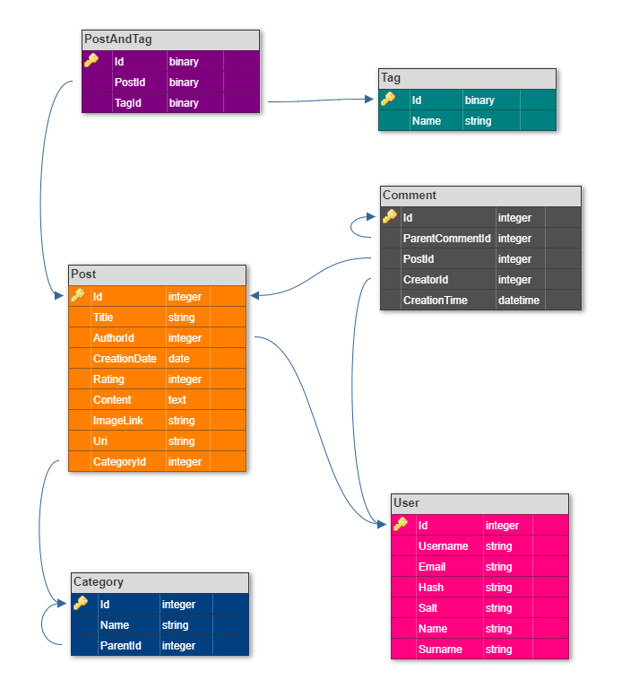

# ShareMe #
## Short Description ##
In this task, you need to develop the data access layer of the blog for the ShareMe startup. Currently, the company doesn't have a well-drafted plan of how the website should work and look like. You will have to be content with only thumbnails of some pages.
## Topics ##
- .NET LINQ
- .NET ORM
- Angular
## Requirements ##
- Consider the website mockups

- Create commands and queries that the system will use for interacting with the database.
- Create console, mobile, desktop or web application to demonstrate how the data access level works with the database.
## Advanced Requirements ##
- The application should create the database if it does not exist.

## Designed DB structure ##
